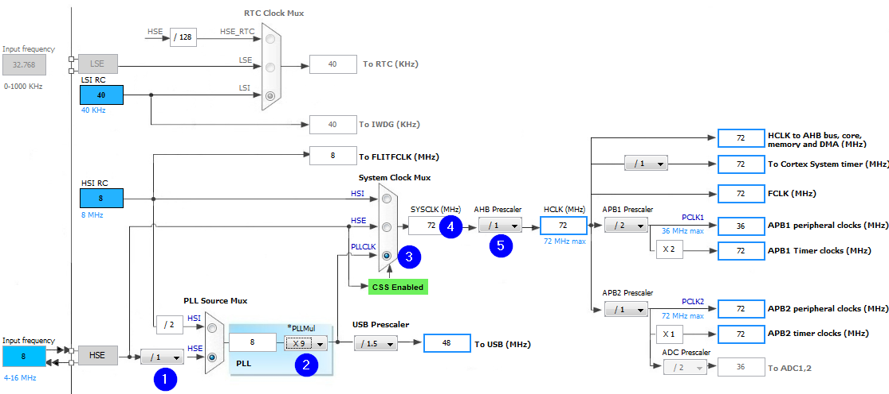

## Setting up project deps. for MacOs
``` bash
xcode-select --install
softwareupdate --all --install --force
brew tap ArmMbed/homebrew-formulae
brew install arm-none-eabi-gcc
```

## Clangd conf
``` bash
compiledb make -j8
```
Or for cmake
``` bash
cmake -DCMAKE_EXPORT_COMPILE_COMMANDS=1
```

## OpenOCD rule in makefile
add this before `# *** EOF \*\*\*`
``` Makefile
flash: all
	openocd -f interface/stlink.cfg -f target/stm32g4x.cfg -c "program $(BUILD_DIR)/$(TARGET).elf verify reset exit"
```

## Clock cnfg 72 MHz
